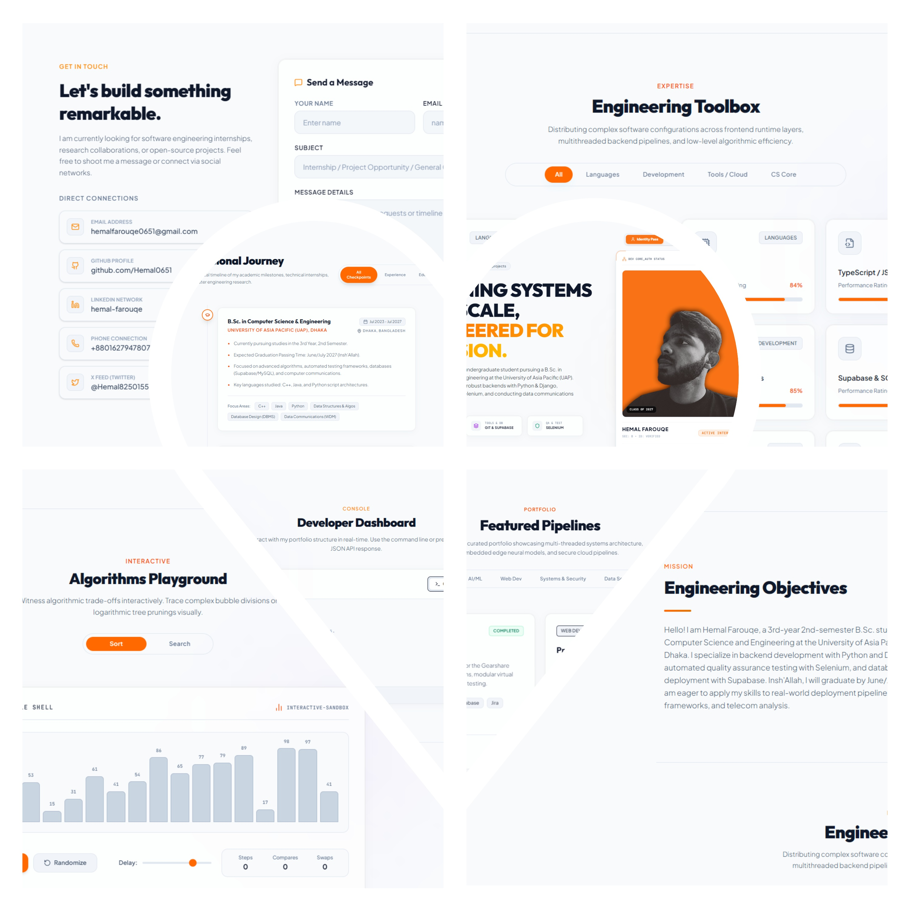

<div align="center">

# Hemal Farouqe — Portfolio

**Designing Systems That Scale, Engineered for Precision.**

[](https://hemal0651.me)
[](https://github.com/Hemal0651)
[](www.linkedin.com/in/hemal-farouqe-204301199)

[](mailto:hemalfarouqe0651@gmail.com)




</div>

---

## About

Personal portfolio of **Hemal Farouqe**, a 3rd-year B.Sc. Computer Science & Engineering student at the University of Asia Pacific (UAP), Dhaka. Specialized in backend development with Python & Django, automated QA testing with Selenium, and data communications research.

This portfolio is built as a fully interactive single-page application — not just a static resume. It features a live CLI emulator, an algorithm visualizer, and a filterable project showcase, designed to give visitors a real sense of how I think and build.

Currently open to **software engineering internships**, research collaborations, and open-source projects.

---

## Features

- 🪪 Developer identity card with live status
- 🖥️ Interactive CLI terminal emulator
- 📊 Algorithm visualizer and sorting playground
- 🗂️ Filterable project showcase
- 🧰 Skills bento grid with proficiency ratings
- 📅 Professional journey timeline
- 📬 Direct contact form

---

## Tech Stack

| Layer | Technology | Purpose |
|:------|:-----------|:--------|
| Framework | React 19 + TypeScript | UI architecture and type-safe components |
| Build Tool | Vite 6 | Fast bundling and hot module replacement |
| Styling | Tailwind CSS 4 | Utility-first responsive design |
| Animation | Framer Motion | Entry transitions and micro-interactions |
| Icons | Lucide React | Consistent vector icon system |
| Deployment | GitHub Pages + gh-pages | Static hosting via custom domain |

---

## Run Locally

Clone the repo and install dependencies:

```bash
git clone https://github.com/Hemal0651/hemal0651.github.io.git
cd hemal0651.github.io
npm install
npm run dev
```

Open http://localhost:3000 in your browser.

---

## Build and Deploy

```bash
npm run build
npm run deploy
```

The live site is served via GitHub Pages on the custom domain hemal0651.me.

---

## Project Structure

src/

├── components/

│   ├── AestheticHero.tsx

│   ├── SkillsBento.tsx

│   ├── ProjectsGrid.tsx

│   ├── AlgoVisualizer.tsx

│   ├── InteractiveTerminal.tsx

│   ├── TimelineJourney.tsx

│   └── ContactSection.tsx

├── App.tsx

└── main.tsx

---

## Contact

- 📧 hemalfarouqe0651@gmail.com
- 🐙 [github.com/Hemal0651](https://github.com/Hemal0651)
- 💼 [linkedin.com/in/hemal-farouqe](https://linkedin.com/in/hemal-farouqe)
- 🌐 [hemal0651.me](https://hemal0651.me)
